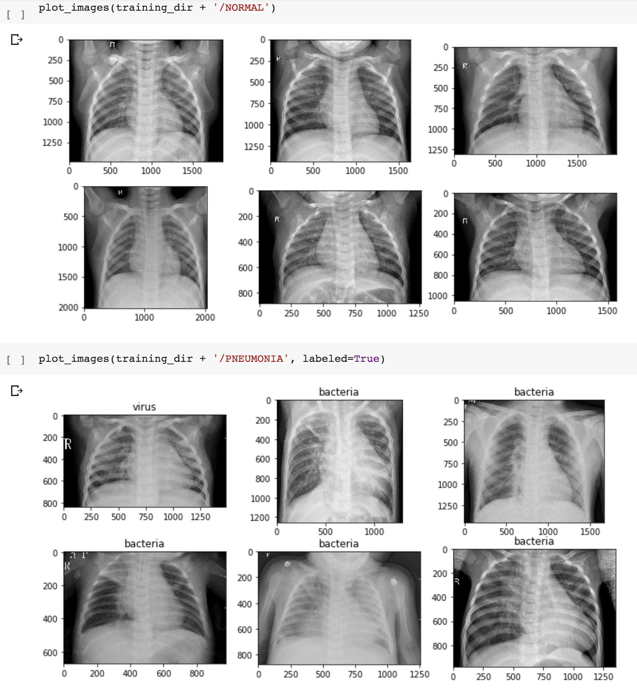

# Chest X-Ray Pneumonia Detection: 
Retrained 'inception v3' image classifier for detecting pneumonia using the dataset provided by [Kaggle](https://www.kaggle.com/paultimothymooney/chest-xray-pneumonia)

Technologies used include TensorFlow/Keras, Python, Google Colab/Jupyter Notebook.

